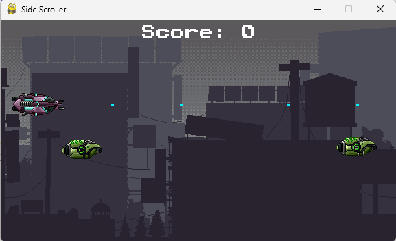

# PyGameSideScroller



## Create the environment

### macOS/Linux

```sh
$ python3 -m venv gameenv
$ source gameenv/bin/activate
$ pip install requirements.txt
```

### Windows

```sh
$ python -m venv gameenv
$ gameenv\Scripts\activate
$ pip install requirements.txt
```

## Run the game

### macOS/Linux

```sh
$ python3 code/main.py
```

### Windows

```sh
$ python code\main.py
```

#### Backgrounds

- https://craftpix.net/freebies/free-scrolling-city-backgrounds-pixel-art/

#### Player Sprites

- https://craftpix.net/freebies/free-pixel-art-enemy-spaceship-2d-sprites/?num=1&count=108&sq=sci%20fi%20shooter&pos=15
